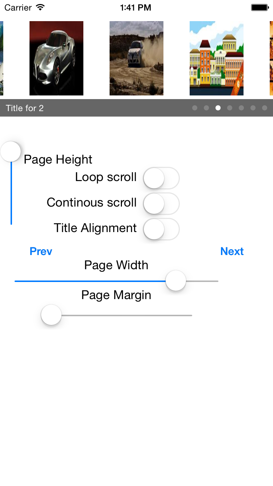
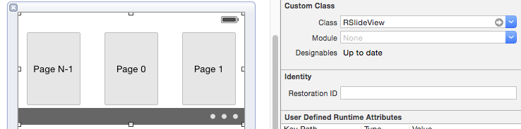
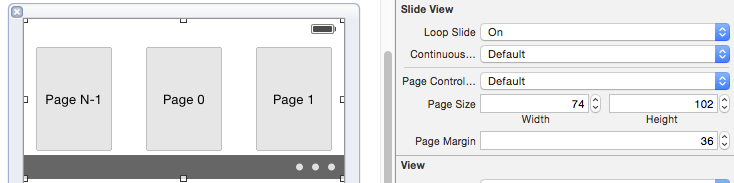

#[R-Slide-View](http://rickytan.github.com/RSlideView)

---

## **Features**:

*  A UITableview like API, easy to use
*  Support Loop Scroll, you can slide to one direction infinitly.
*  Support Continuois Scroll, when it stops scrolling, it will adjust the offset to one entire page automaticlly.
*  Support pageSize, pageMargin config, much flexible.
*  Interface Builder support, just drag a **UIView** and set its Class to **RSlideView** and ready to go.



## **Interface Builder**:

- **Step 1.** Drag and drop a **UIView** from Object Library to your own view
- **Step 2.** Set and **UIView**'s class to **RSlideView**



- **Step 3.** Set the property as you wish




## **Requirements**:

* iOS 5 and up
* Xcode 6.0
* Frameworks: Foundation, UIKit

## LICENSE
**MIT**

```
Copyright (c) 2015 Ricky Tan

Permission is hereby granted, free of charge, to any person obtaining a copy
of this software and associated documentation files (the "Software"), to deal
in the Software without restriction, including without limitation the rights
to use, copy, modify, merge, publish, distribute, sublicense, and/or sell
copies of the Software, and to permit persons to whom the Software is
furnished to do so, subject to the following conditions:

The above copyright notice and this permission notice shall be included in
all copies or substantial portions of the Software.

THE SOFTWARE IS PROVIDED "AS IS", WITHOUT WARRANTY OF ANY KIND, EXPRESS OR
IMPLIED, INCLUDING BUT NOT LIMITED TO THE WARRANTIES OF MERCHANTABILITY,
FITNESS FOR A PARTICULAR PURPOSE AND NONINFRINGEMENT. IN NO EVENT SHALL THE
AUTHORS OR COPYRIGHT HOLDERS BE LIABLE FOR ANY CLAIM, DAMAGES OR OTHER
LIABILITY, WHETHER IN AN ACTION OF CONTRACT, TORT OR OTHERWISE, ARISING FROM,
OUT OF OR IN CONNECTION WITH THE SOFTWARE OR THE USE OR OTHER DEALINGS IN
THE SOFTWARE.
```